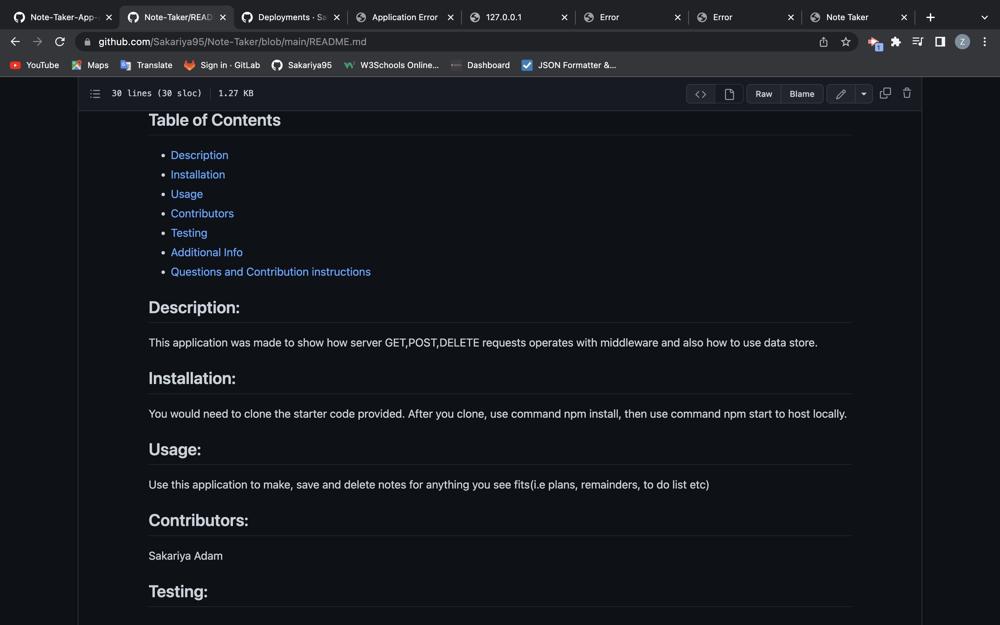
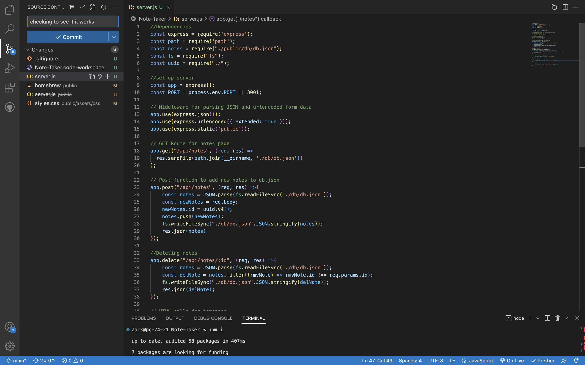

# Note-Taker
  ## Deployed App
[  https://.herokuapp.com/](https://note-taker-2023challenge11.herokuapp.com/)
  
  
  ## Table of Contents 
  - [Description](#description)
  - [Installation](#installation)
  - [Usage](#usage)
  - [Contributors](#contributors)
  - [Testing](#testing)
  - [Additional Info](#additional-info)
  - [Questions and Contribution instructions](#questions-and-contribution-instructions)
  ## Description:
  This application was made to show how server GET,POST,DELETE requests operates with middleware and also how to use data store.
  ## Installation:
  You would need to clone the starter code provided. After you clone, use command npm install, then use command npm start to host locally.
  ## Usage:
  Use this application to make, save and delete notes for anything you see fits(i.e plans, remainders, to do list etc)
  ## Contributors:
  Sakariya Adam
  ## Testing:
  -
  ## Additional Info:
  - Github: [Sakariya95](https://github.com/Sakariya95)
  ## Questions and Contribution instructions: 
  Please contact this email address if you have any questions about the project or any feedback for improvement thanks.
  - Email: niyyex@live.co.uk
  ## Licensing:
  